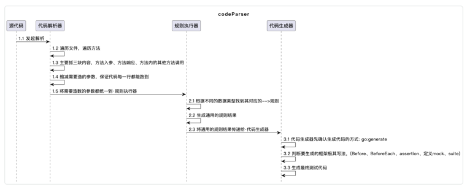

# caseGenerator
quickly generate test cases

> 梳理代码解析流程，形成通用的自动实现测试用例功能。

### 1. 解析流程
解析流程使用parser.ParserFile从文件维度逐一解析不同文件逐行进行解析，使用walk一行接一行遍历的解析，将有可能用到的属性都存储起来。
某些情况，比如说方法调用时传递了指针，那么需要遍历解析去判断这个属性做了什么改变规则.

按照go语言结构中，不同的数据类型可能会有不一样的问题，需要穷举出所有的数据类型，抽象出公共的逻辑成为方法，最终要支持Walk方法。
比如说每个节点都实现Node接口，Node接口定义各自需要遵守的规则，比如说遇到指针作为入参，那么验证是nil的情况

● 指针：可能是nil；作为方法参数传递需要遍历获取其有可能的取值

● jsonString：需要反序列化回去

● 列表：有可能是空列表；一个元素；多个元素

● map：对应的key可以取到值；对应的key取不到值

● struct：最终的属性都还是基本类型，需要能够支持解析属性、属性的属性

● string、int、bool：能否都转为json

● channel：最好可以支持压测

● 类型断言：修改入参类型，不修改入参类型

● if：解析出不同的条件可能性以及逻辑，判断能不能直接就拿到返回值

● switch：判断case的值以及里面的逻辑，判断fallthrough

● for：判断多条、一条、0条记录；判断是否有取值问题

● fori：

● range：

● 匿名行数：和函数一样的处理方式，要多带入几个参数

● goroutine：判断是否有并发问题

● defer代码块：判断最终是否能走到；配合recover使用时，是不是有异常

### 2. 生成代码
生成代码的方式

● go:generate  生成对应框架的代码
● mockey

### 3. 流程图

### 4. 开发任务

- [x] 解析request
- [x] 解析receiver
- [x] 解析response
- [x] 解析类型断言
- [x] 解析赋值
- [ ] 解析condition
- [x] 完成所有的特殊情况的example
- [ ] 完善readme
- [ ] 打tag包，进行远程调用使用
- [ ] 怎么更加可拓展
- [ ] 怎么远程调用

